## CONEXIONES DE BACKEND Y FRONTEND
## Backend
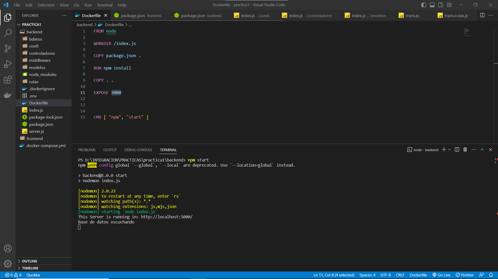
## Frontend
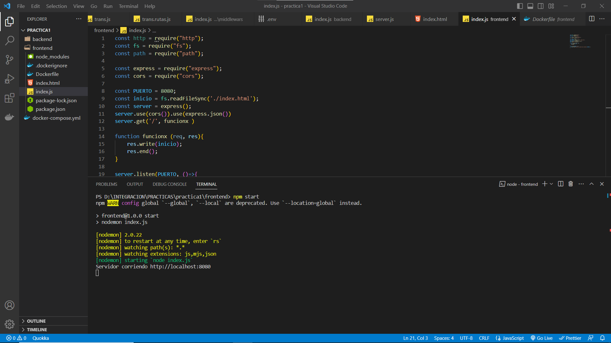

## ejecutamos y construimos la aplicacion mediante el "docker compose up"
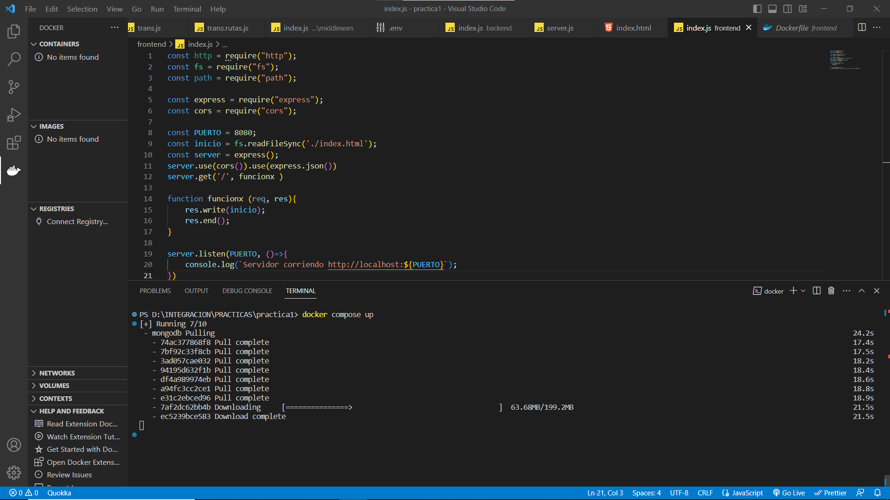

## se crean las imagenes
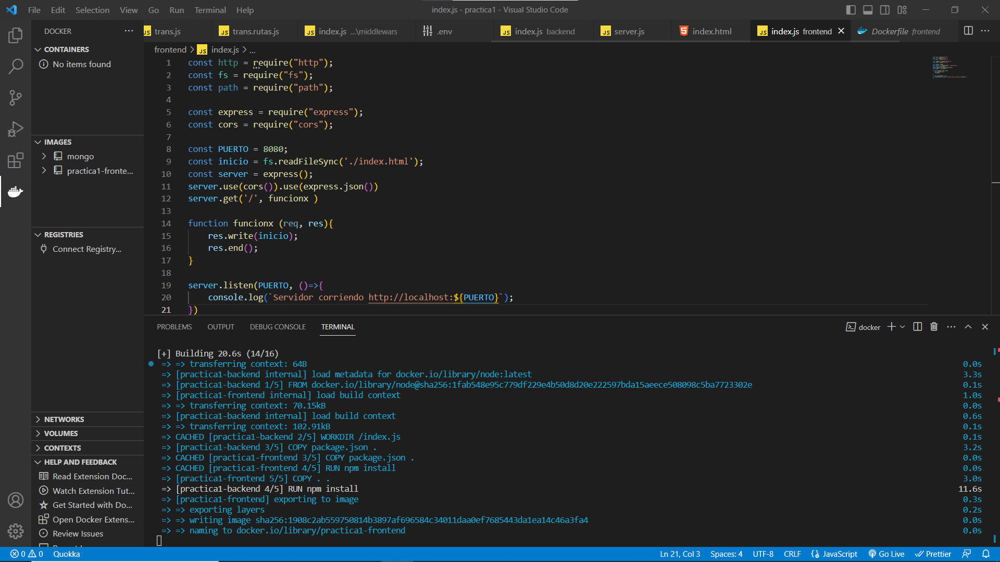

## se crean contenedores
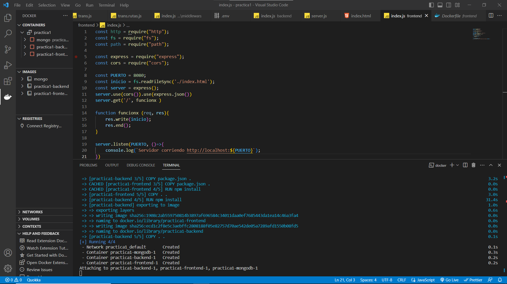
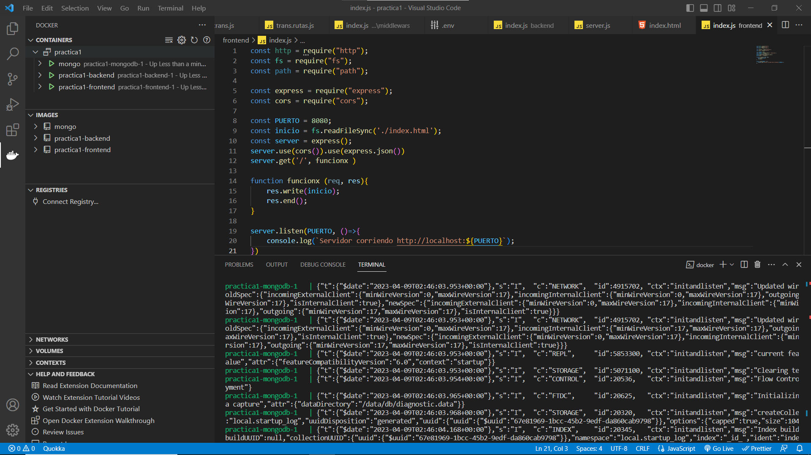

## resultados
## conexiones
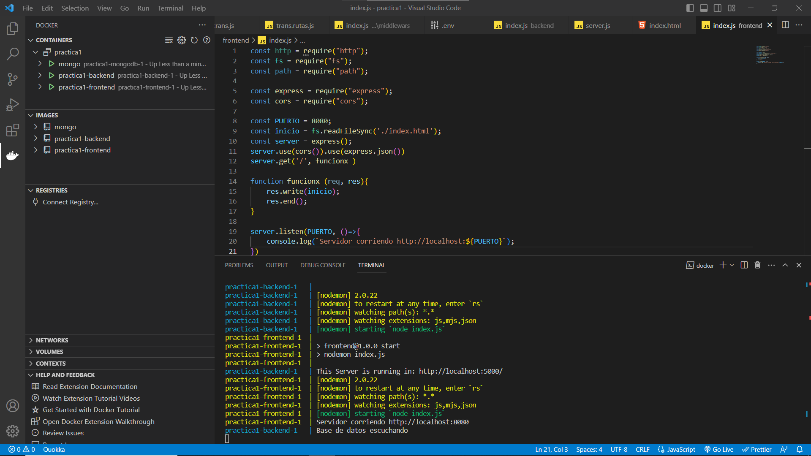
## Backend
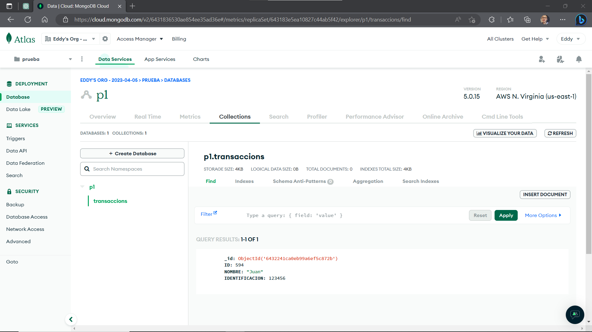
## Fronted
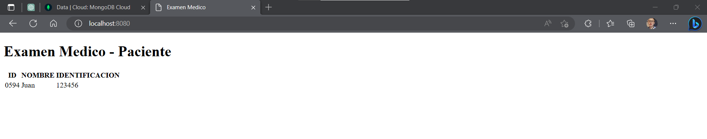
## Docker Containers
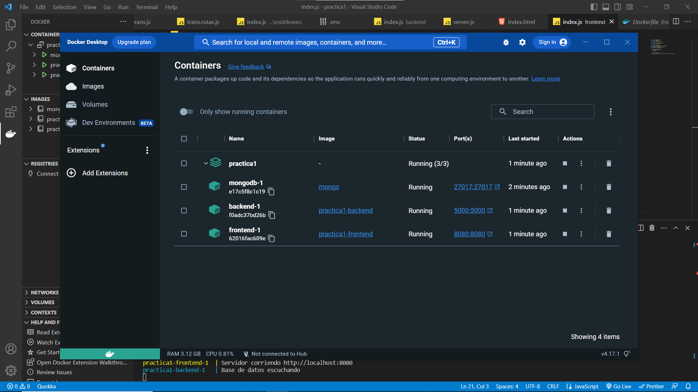
## Docker Imagenes
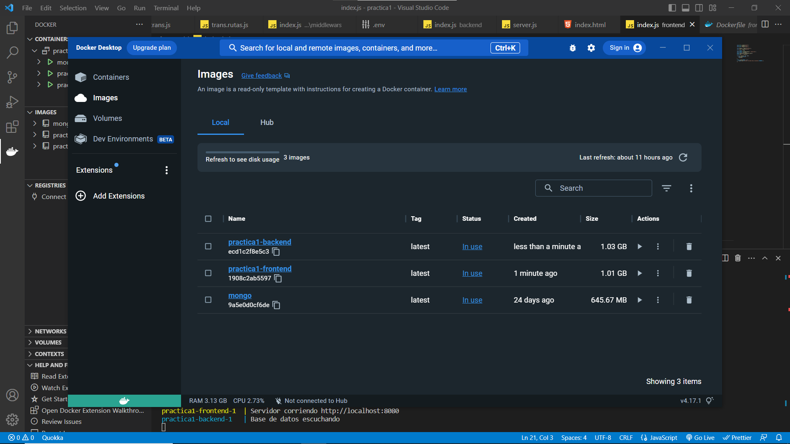

